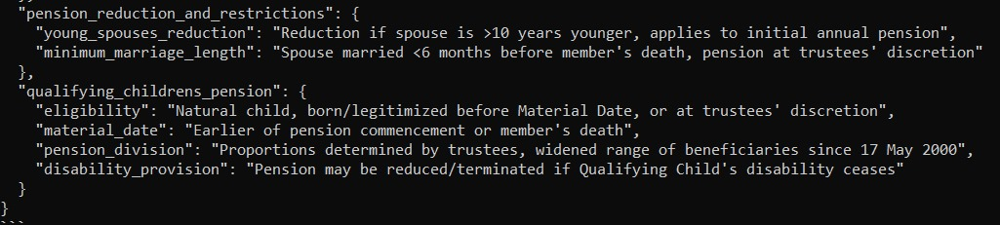

# Pension Recommendation

## Description of project
This pension recommendation system enables insurance providers to upload client documents (such as name, age, and employment details) to accurately assess the potential pension entitlements for clients based on a specific pension scheme.

## Instructions to run the UI

### Prerequisite
1) To avoid dependency overlaps, create a virtual environment
```conda create -n myenv python=3.10```
3) Activate the environment
```conda activate myenv```

### To run the program
1) Navigate into the Backup folder
2) Run the following command
'''pip install -r requirements.txt'''

3) To run the project, run the following command
'''waitress-serve --listen=127.0.0.1:8080 project.wsgi:application'''

## Instructions to run the UAgents

### Prerequisite
Download the Uagents library ```pip install uagents```

### To run the program
```python agents.py```

## Use-case example

1) An admin user uploads the different pdfs pension schemes that they want to compare (this can be a list, table, dataframe etc):

2) The client uploads the details of their employees to the chat(this can be a list, table, dataframe etc):

3) The program then recommends pension entiltlment for every client based on the pension scheme, and explains why this is the calculated value.

## Special considerations

# UAgents

## APIs Used
* Cohere
* Llama Index

## Analysis Agent
It takes in the information from the scheme data uploaded by the user and it summarises the information in such a way that people with no background knowledge can uderstand the different schemes.

### Output


## Mapping Agent
It takes in the information of the employees from the data uploaded by the user and it extracts the relevent details like age, marriage status and more.

### Output


## Recommendation Agent
It takes in the data points mapped from the Mapping Agent and gives out recommendations based on fields derived from the Analysis Agent.

### Output
